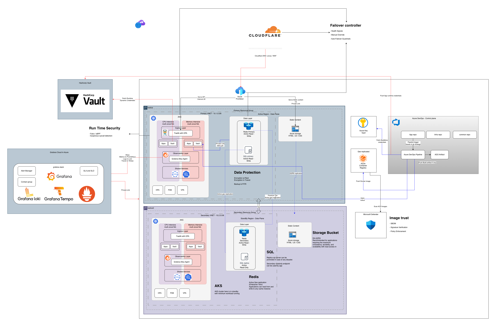
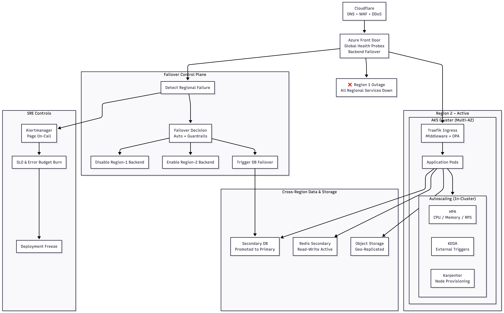

# Azure Architecture

This repository contains the architecture documentation for a cloud-native Azure-based application deployment.

## Overview

The architecture implements a multi-region, highly available, and secure cloud infrastructure leveraging Azure Kubernetes Service (AKS), Cloudflare for edge security, and various Azure and cloud-agnostic services.

## Architecture Diagram

For a Mermaid-based interactive version:

## Key Components

### Edge & Zero Trust
- **Users**: End users accessing the application
- **Cloudflare**: Provides DNS, Web Application Firewall (WAF), and DDoS protection
- **Azure Front Door**: Global traffic management and load balancing

### CI/CD & Governance
- **Helm Template Repo**: Repository containing golden Helm charts
- **Application Repo**: Source code repository for the application
- **Infra Repo**: Infrastructure as Code using Terraform
- **Build Pipeline**: Creates container images and Helm packages with SAST and DAST scanning
- **Deploy Pipeline**: Applies Terraform configurations for infrastructure deployment and rolls out application Helm charts

### Container Registry
- **Azure Container Registry (ACR)**: Stores trusted container images
- **Helm Chart Registry**: Repository for Helm charts

### Multi-Region Deployment
- **Region 1 (Active)**: Primary region with full AKS cluster
- **Region 2 (Standby)**: Secondary region for failover and disaster recovery

Each region includes:
- **AKS Cluster**: Multi-Availability Zone Kubernetes clusters
- **Traefik Ingress**: Ingress controller with middleware and Open Policy Agent (OPA) integration
- **Application Pods**: Containerized application workloads
- **Horizontal Pod Autoscaler (HPA) + KEDA**: Auto-scaling based on metrics and events

### Data & Cache Layer
- **Primary Database**: Multi-region replicated database
- **Redis Cluster**: Multi-region Redis cluster for global and regional caching
- **Object Storage**: For static assets and file storage

### Observability
- **Prometheus**: Metrics collection and monitoring
- **Grafana**: Visualization and dashboards
- **Loki**: Log aggregation
- **Alertmanager**: Alert management and notifications
- **SLO & Error Budget**: Service Level Objectives and error tracking

### Security
- **Vault**: Secrets management
- **Workload Identity**: Secure identity for workloads
- **OPA Policies**: Policy enforcement at ingress level

## Traffic Flow
1. User requests enter through Cloudflare for initial security filtering
2. Traffic is routed via Azure Front Door for global load balancing
3. Requests are processed by Traefik ingress controllers with OPA policy enforcement
4. Applications access data layer services (DB, Redis, Object Storage)
5. Observability stack monitors all components
6. Security services ensure proper authentication and authorization

## Deployment Strategy
- **Active-Standby**: Region 1 handles primary traffic, Region 2 ready for failover
- **CI/CD Pipelines**: Automated build and deployment using Azure DevOps/GitHub Actions
- **Infrastructure as Code**: Terraform manages all cloud resources
- **GitOps**: Helm charts and Kubernetes manifests stored in repositories

## Security Principles

## Monitoring & Alerting

## Region Outage Scenario

In the event of a region outage (e.g., Region 1 becomes unavailable), the architecture ensures:

- **Automatic failover**: Azure Front Door reroutes traffic to the standby region (Region 2) with minimal downtime.
- **Multi-region Redis Cluster**: Redis data is synchronized across regions, ensuring cache consistency and availability.
- **Database Replication**: The primary database supports multi-region replication, so data remains accessible.
- **CI/CD Rollouts**: Pipelines can redeploy applications and infrastructure to the standby region as needed.
- **Observability**: Monitoring and alerting continue to function, providing visibility into failover events and system health.
- **Security**: All security controls and policies remain enforced in the standby region.

This design provides high availability, business continuity, and resilience against regional failures.