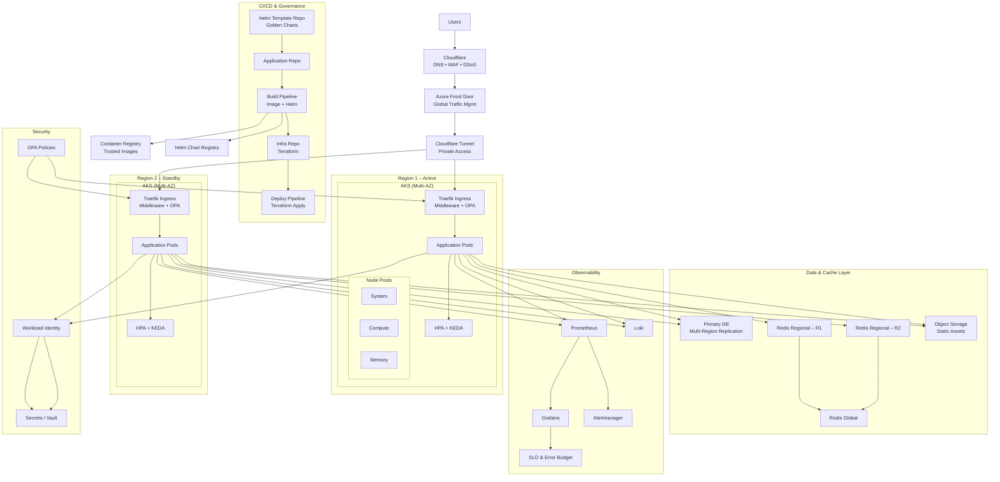

```mermaid
flowchart TB
    %% =====================
    %% EDGE & ZERO TRUST
    %% =====================
    U[Users]

    CF[Cloudflare<br/>DNS • WAF • DDoS]

    FD[Azure Front Door<br/>Global Traffic Mgmt]

    TUN[Cloudflare Tunnel<br/>Private Access]

    U --> CF --> FD --> TUN

    %% =====================
    %% CI/CD & GOVERNANCE
    %% =====================
    subgraph CICD["CI/CD & Governance"]
        HTR[Helm Template Repo<br/>Golden Charts]
        AR[Application Repo]
        IR[Infra Repo<br/>Terraform]

        PIPE1[Build Pipeline<br/>Image + Helm]
        PIPE2[Deploy Pipeline<br/>Terraform Apply]

        HTR --> AR --> PIPE1 --> IR --> PIPE2
    end

    PIPE1 --> ACR
    PIPE1 --> HREG

    %% =====================
    %% REGISTRY
    %% =====================
    ACR[Container Registry<br/>Trusted Images]
    HREG[Helm Chart Registry]

    %% =====================
    %% REGION 1 – ACTIVE
    %% =====================
    subgraph R1["Region 1 – Active"]
        subgraph AKS1["AKS (Multi-AZ)"]
            ING1[Traefik Ingress<br/>Middleware + OPA]

            subgraph NP1["Node Pools"]
                SYS1[System]
                CPU1[Compute]
                MEM1[Memory]
            end

            APP1[Application Pods]
            SCALE1[HPA + KEDA]
        end

        ING1 --> APP1 --> SCALE1
    end

    %% =====================
    %% REGION 2 – STANDBY
    %% =====================
    subgraph R2["Region 2 – Standby"]
        subgraph AKS2["AKS (Multi-AZ)"]
            ING2[Traefik Ingress<br/>Middleware + OPA]
            APP2[Application Pods]
            SCALE2[HPA + KEDA]
        end

        ING2 --> APP2 --> SCALE2
    end

    %% =====================
    %% PRIVATE TRAFFIC FLOW
    %% =====================
    TUN --> ING1
    TUN --> ING2

    %% =====================
    %% DATA & CACHE
    %% =====================
    subgraph DATA["Data & Cache Layer"]
        DB[Primary DB<br/>Multi-Region Replication]
        REDISG[Redis Global]
        REDISR1[Redis Regional – R1]
        REDISR2[Redis Regional – R2]
        OBJ[Object Storage<br/>Static Assets]
    end

    APP1 --> DB
    APP2 --> DB

    APP1 --> REDISR1 --> REDISG
    APP2 --> REDISR2 --> REDISG

    APP1 --> OBJ
    APP2 --> OBJ

    %% =====================
    %% OBSERVABILITY (CLOUD-AGNOSTIC)
    %% =====================
    subgraph OBS["Observability"]
        PROM[Prometheus]
        GRAF[Grafana]
        LOKI[Loki]
        ALERT[Alertmanager]
        SLO[SLO & Error Budget]
    end

    APP1 --> PROM
    APP2 --> PROM
    PROM --> GRAF --> SLO
    APP1 --> LOKI
    APP2 --> LOKI
    PROM --> ALERT

    %% =====================
    %% SECURITY
    %% =====================
    subgraph SEC["Security"]
        VAULT[Secrets / Vault]
        ID[Workload Identity]
        POLICY[OPA Policies]
    end

    APP1 --> ID --> VAULT
    APP2 --> ID --> VAULT
    POLICY --> ING1
    POLICY --> ING2
```